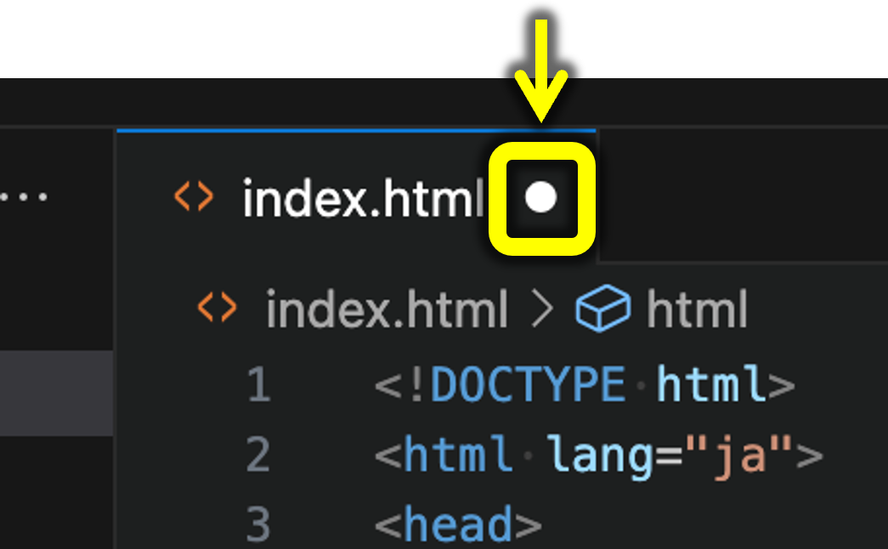
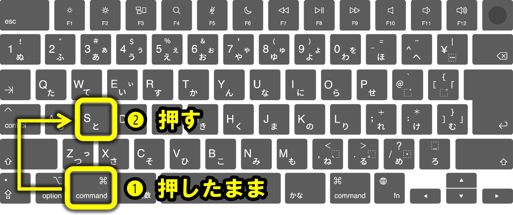
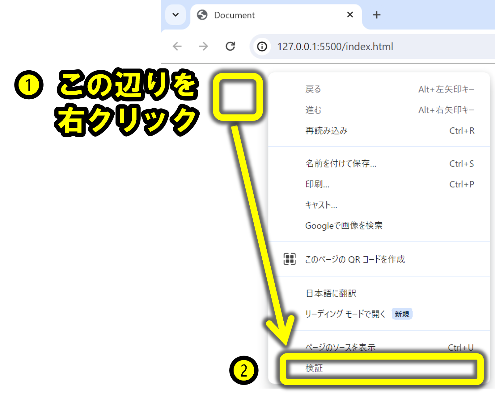
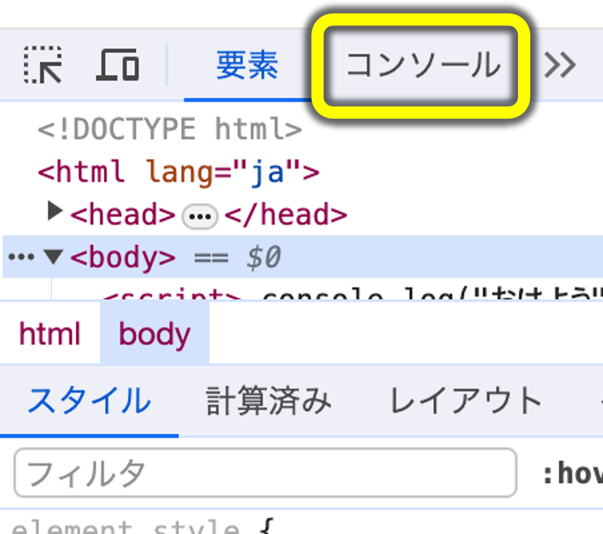
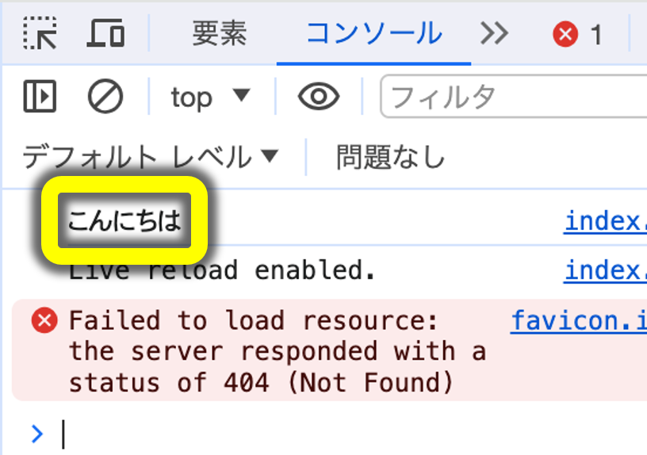
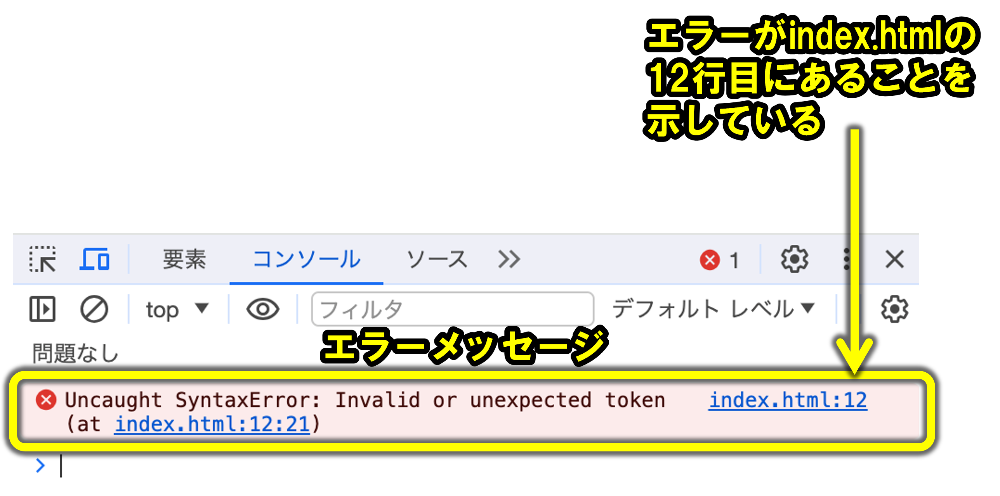

# ブラウザで確認する

HTML、CSS、JavaScriptを書いたら、保存してからブラウザで表示や動作を確認します。

JavaScriptの結果やエラーは、Chrome の DevTools にある Console で確認できます。

## 保存する

タブのファイル名の横に黒丸（●）がついているときは、 _保存されていない状態_

次のキーで保存できる。

| キー | 動作 | 覚え方 |
| :-: | :-: | :-: |
| Cmd + S | 保存 | S は Save(保存) の頭文字 |

:::note
Windowsでは、`Ctrl + S` で保存できます。
:::

## 動作確認

1. Opt + B を押す
2. 起動した Chrome 上で [右クリック] → [検証] を押す

3. [コンソール] タブを開く

4. 「こんにちは」が表示されているのが確認できる（打ち間違いがある場合はここでエラーを確認できる）

### 成功例

### 失敗例

エラーが表示されたときは、エラーが起きたファイル名や行番号を確認します。

## HTML文法チェック

**説明**: W3Cバリデータを使って自分のHTMLを検証し、エラーや警告を確認する。

**手順**:

1. ブラウザで「html validate」で検索
2. 「File Upload」または「Direct Input」で自分のHTMLを入力
3. 「Check」ボタンをクリックしてエラーを確認

:::note
バリデータの表示は英語の場合があります。まずはエラーの行番号と、問題になっているタグ名や属性名を探してください。
:::

## 覚えておくこと

- 黒丸（●）がついているときは、保存されていない状態です。
- 保存してからブラウザで確認します。
- DevTools の Console で実行結果やエラーを確認できます。
- HTML文法チェックには、W3Cバリデータを使えます。
