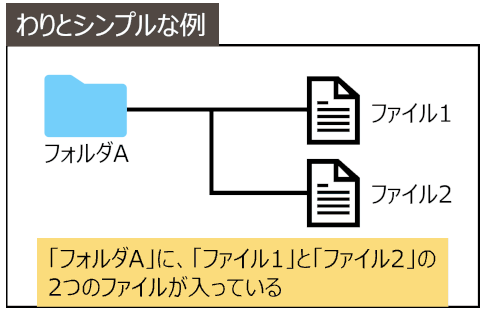
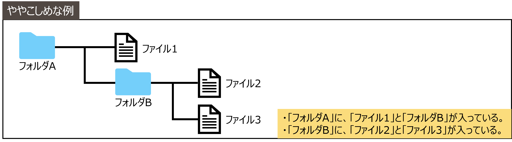
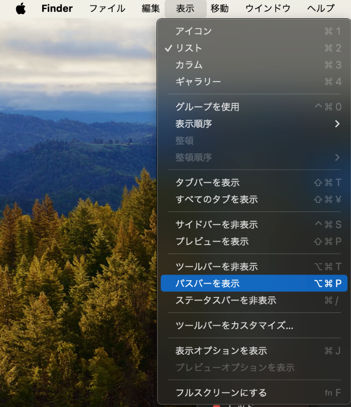
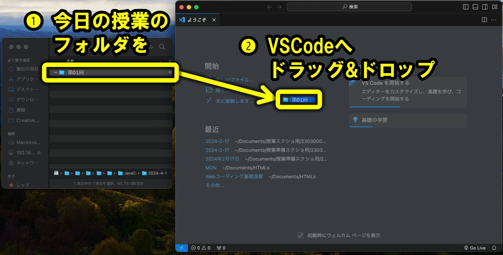
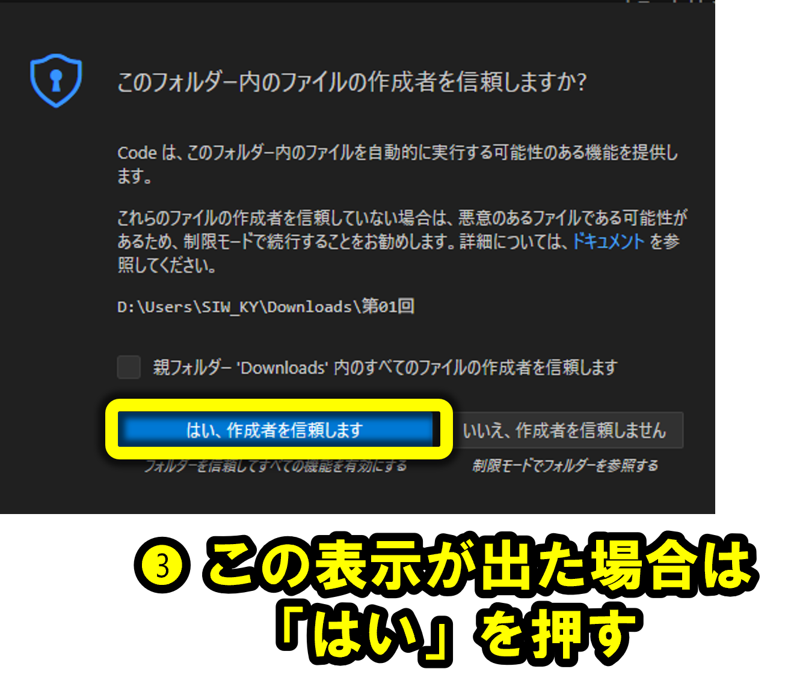

# ファイル・フォルダ・拡張子

Web制作では、HTML、CSS、JavaScript、画像など、複数のファイルを組み合わせます。

ファイルやフォルダを適切に管理できると、HTMLから画像、CSS、JavaScriptを読み込むときに迷いにくくなります。

## ファイルとフォルダ

- ファイル: 1 つの データ のこと（画像、動画、音楽のデータなど）
- フォルダ: ファイルやフォルダをまとめて整理するための箱 のこと

### わりとシンプルな例

### ややこしめな例

:::caution
ファイルやフォルダがぐちゃぐちゃだとファイルが紛失します。適切に管理しましょう。
:::

## フォルダの階層構造を見やすくするために、パスバーを表示

1. Finder を起動する

2. 上部のメニューから、[表示] > [パスバーを表示]を押す。

## ファイル名・フォルダ名の注意点

- ファイル名、フォルダ名に絶対に使ってはいけない文字：「/」（スラッシュ）
- ファイル名、フォルダ名で区切りを入れるときによく使われる文字：「-」（ハイフン）、 「_」（アンダースコア）

## VSCodeでフォルダを開く

VSCodeでは、ファイル単体ではなく、作業するフォルダごと開くとファイル同士の位置関係を確認しやすくなります。

## ファイル名の構成

例：`index.html`、`main.js`、`report.pdf`

### 拡張子の例

ドット以降の部分を「拡張子」といいます。ファイルの種類を表します。

| 拡張子 | ファイルの種類 |
| --- | --- |
| `.docx` | 最近のMicrosoft Office Word文書 |
| `.pdf` | PDF文書 |
| `.html` | HTMLファイル |
| `.css` | CSSファイル |
| `.js` | JavaScriptファイル |
| `.jpg` | 画像ファイル |
| `.png` | 画像ファイル |

:::note
Web制作では、`index.html`、`style.css`、`index.js` のような名前をよく使います。
:::

## 覚えておくこと

- ファイルは、1つのデータのことです。
- フォルダは、ファイルやフォルダをまとめて整理するための箱です。
- ドット以降の部分を「拡張子」といいます。
- VSCodeでは作業フォルダごと開くと、ファイルの位置関係を確認しやすくなります。
