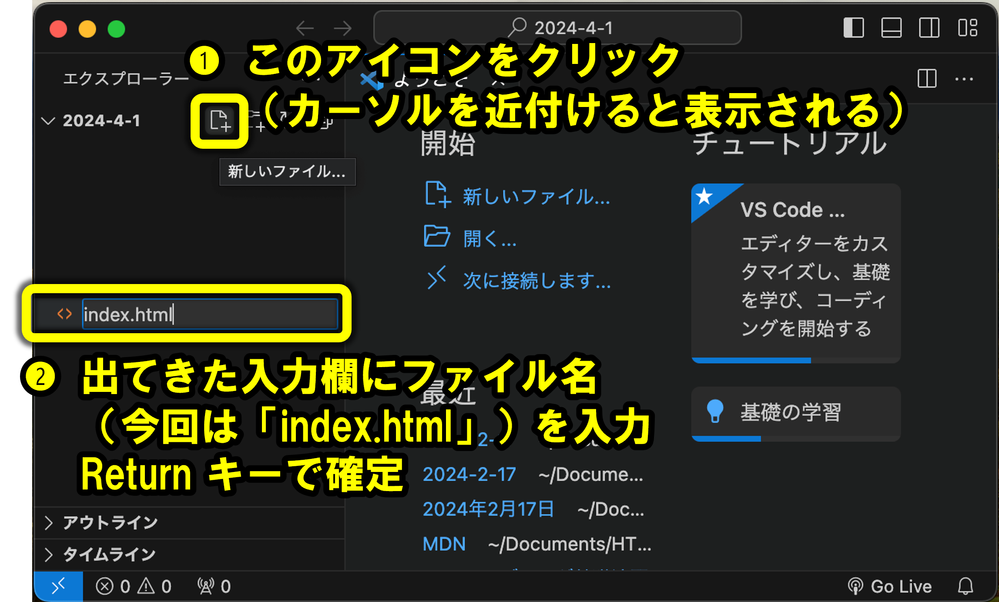
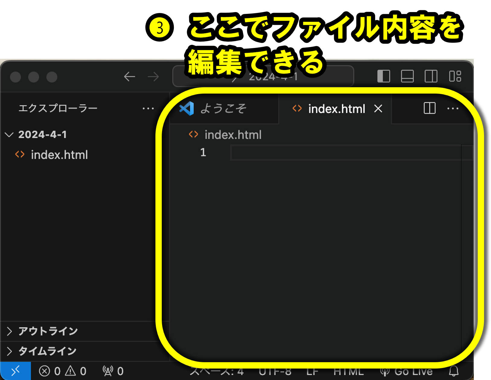
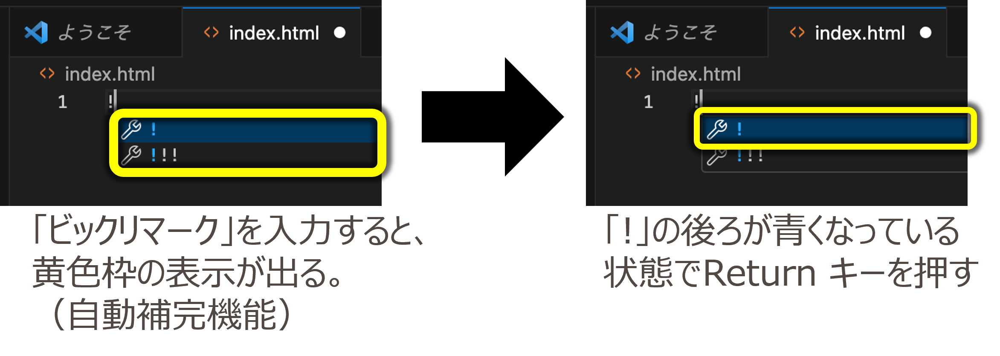

# HTML文書の基本形

HTMLファイルには、Webページとして読み取ってもらうための基本形があります。

HTML文書の先頭には、HTMLであることの宣言や、ページに表示されない情報、画面に表示される内容を書く場所を用意します。

## HTMLファイルを作成する




作業フォルダを開いた状態で、新しいファイルを作成し、ファイル名を `index.html` にします。

## HTMLファイルを記述する



すると、次の内容が自動入力される：

```html
<!DOCTYPE html>
<html lang="ja">
<head>
    <meta charset="UTF-8">
    <meta name="viewport" content="width=device-width, initial-scale=1.0">
    <title>Document</title>
</head>
<body>
    
</body>
</html>
```

## `<!DOCTYPE html>`

- HTML文書であることを宣言
- 文書の先頭に必ず書く

## `<html lang="ja">`

- HTML文書のルート要素
- `lang`属性で言語を指定
  - 日本語の場合は`ja`
  - 例：`<html lang="ja">`

## `<head>`

- 文書のメタ情報を記述
- 通常含まれるもの：
  - `<title>`: ページのタイトル
  - `<meta>`: 文字コードなどの情報
  - `<style>`: CSS
  - `<link>`: 外部ファイルのリンク
  - `<script>`: JavaScript

## `<meta charset="UTF-8">`

文字コードなどの情報を指定します。

日本語を扱うページでは、基本的には `UTF-8` を指定します。

## `<title>`

Webページのタイトルです。ブラウザのタブに表示されます。

```html
<title>自己紹介ページ</title>
```

## `<body>`

- ページに表示される内容を記述
- 通常含まれるもの：
  - 文章
  - 見出し（`<h1>`～`<h6>`）
  - 段落（`<p>`）
  - リスト（`<ul>`, `<ol>`, `<li>`）
  - リンク（`<a>`）
  - 画像（``）
  - その他のコンテンツ

```html
<body>
    <h1>自己紹介</h1>
    <p>こんにちは。</p>
</body>
```

## 覚えておくこと

- HTMLファイルは基本形から始めます。
- `<head>` にはページの情報を書きます。
- `<body>` には画面に表示したい内容を書きます。
