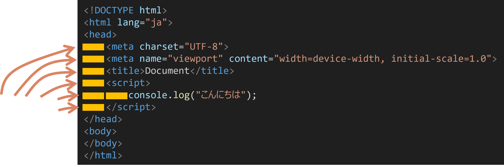
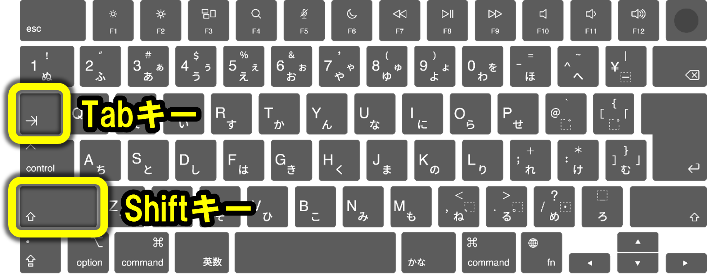

# 入れ子とインデント

HTMLでは、要素の中に別の要素を入れることがあります。

入れ子構造を読むときは、開始タグと終了タグの対応と、コード左側の余白を確認します。

## 入れ子とは

- 要素の中に別の要素を入れること
- 親要素と子要素の関係ができる

### 正しい入れ子の例

```html
<ul>
  <li>項目1</li>
  <li>項目2</li>
</ul>
```

### 間違った入れ子の例

```html
<ul>
  <li>項目1
</ul>
  </li>
```

- タグの順序が正しくない
- 開始タグと終了タグの対応が取れていない

### 入れ子のルール

1. 開始タグと終了タグの順序を正しくする
2. 親要素の開始タグ → 子要素の開始タグ → 子要素の終了タグ → 親要素の終了タグ
3. タグの対応関係を明確にする

## インデント

コードの左の方に書いた余白のことを「 インデント 」という。



```html
<section>
  <h2>お知らせ</h2>
  <p>明日は休講です。</p>
</section>
```

## Tab / Shift + Tab

次のキーでインデントの追加/削除ができる

| キー | 動作 | 覚え方 |
| :-: | :-: | :-: |
| Tab | インデントの追加 | ない |
| Shift + Tab | インデントの削除 | Tabの逆（Shift が逆を表すことが多い） |



## 覚えておくこと

- 入れ子とは、要素の中に別の要素を入れることです。
- 開始タグと終了タグの順序を正しくします。
- インデントとは、コードの左の方に書いた余白のことです。
