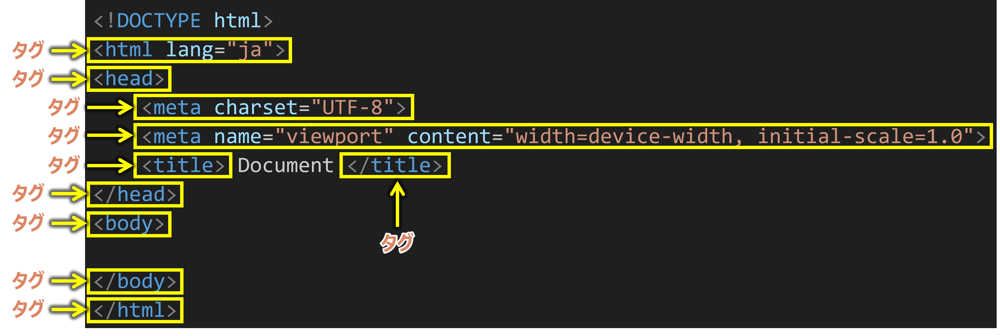
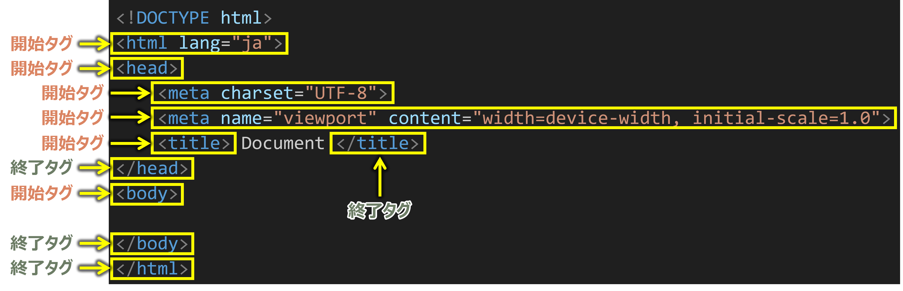
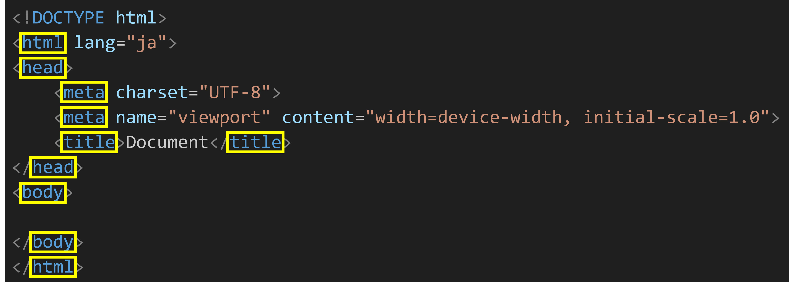
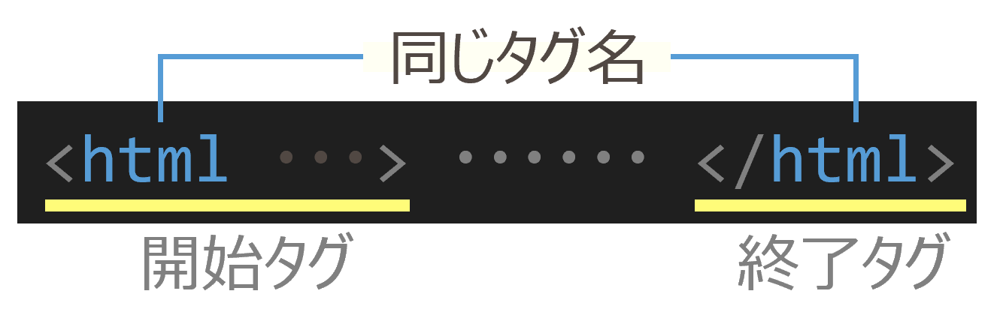
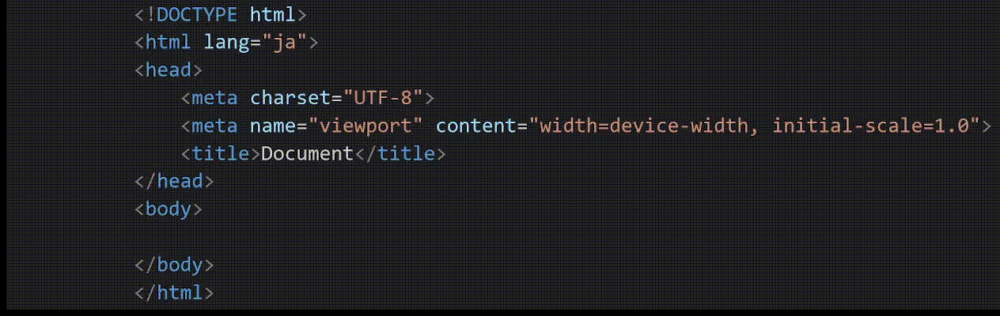

# タグ・要素・属性

HTMLはWebページを作るための言語です。

HTMLを読むときは、タグ、開始タグ、終了タグ、タグ名、要素、属性という言葉をよく使います。

## タグとは？

タグとは `<` と `>` で囲まれた部分（`<!DOCTYPE html>` は除く）のこと。



```html
<p>こんにちは</p>
```

この例では、`<p>` と `</p>` がタグです。

## 開始タグ・終了タグとは？

- 開始タグ： `<…>` の形（先頭にスラッシュがない）
- 終了タグ： `</…>` の形（先頭にスラッシュがある）



## タグ名とは？

`<〇〇 ...>` または `</〇〇>` の 〇〇 の部分

例：`html`, `head`, `meta`, `title`, `body`



## 要素とは？

同じタグ名をもつ開始タグ～終了タグのひとかたまり（終了タグのない要素もある）



```html
<p>こんにちは</p>
```

この全体が `p` 要素です。

### 例



:::note
`<meta>` や `` のように、終了タグのない要素もあります。
:::

## 属性とは？

開始タグ内の、`要素名` の後に続く、スペースで区切られた `属性名="属性値"` の部分を **属性** といいます。

```html
<要素名 属性名="属性値" 属性名="属性値">
```

- 1つの要素に複数の属性を指定することができます
- 属性と属性の間は半角スペースで区切ります

### 例

```html
<html lang="ja">
    ...
</html>
```

- 属性：`lang="ja"`

```html
<meta charset="UTF-8">
```

- 属性：`charset="UTF-8"`

```html
<a href="https://example.com" target="_blank">サンプルリンク</a>
```

- 属性：`href="https://example.com"` と `target="_blank"`

## 覚えておくこと

- タグは `<` と `>` で囲まれた部分です。
- 開始タグは先頭にスラッシュがなく、終了タグは先頭にスラッシュがあります。
- 要素は、同じタグ名をもつ開始タグ～終了タグのひとかたまりです。
- 属性は、要素の特性を指定するものです。
